# Demos - Demokracija 2.0

Prototip spletne platforme za oddajo, pregled, glasovanje, komentiranje, AI predpregled in analitiko zakonodajnih pobud.

## Projektna dokumentacija za prevzem projekta


### Namen sistema

Demokracija 2.0 je prototip platforme za pripravo zakonodajnih pobud. Uporabnik lahko pregleda pobude, odda novo pobudo, dobi AI predpregled skladnosti, glasuje, komentira in pobudo podpise s SI-PASS identiteto. Sistem enkrat letno pobude zapakira za posiljanje v Drzavni zbor, dnevno pa ustvarjalcem pobud posilja povzetek novih glasov, podpisov in komentarjev.

Sistem je zgrajen kot majhna web aplikacija brez klasicnega frameworka. Frontend je v `src/main.js`, domenska pravila so locena v `src/domain/*`, podatkovni dostop je v `src/lib/*`, backend endpointi pa so loceni v `api/*` in `server/*`. Produkcijski deployment cilja na Vercel + Supabase, lokalni razvoj pa uporablja `scripts/dev-server.mjs`.

### Glavni uporabniki in use case diagram

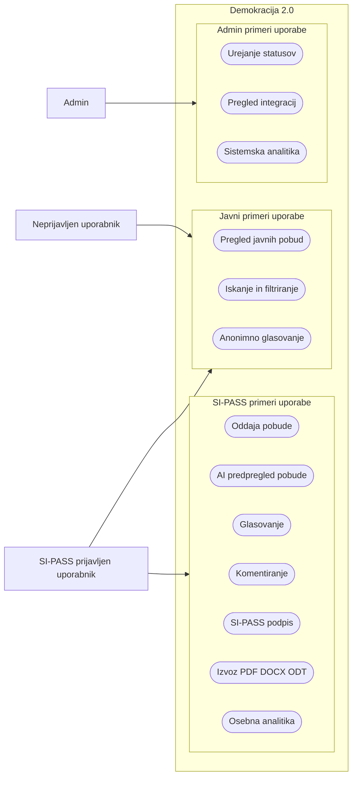

### Kontekstni diagram sistema

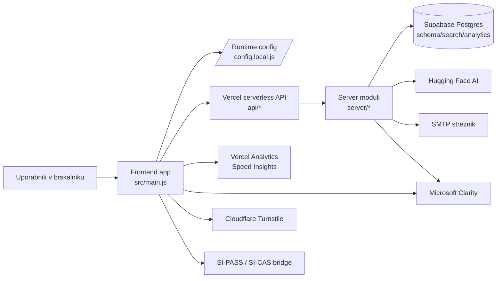

### Arhitektura po plasteh

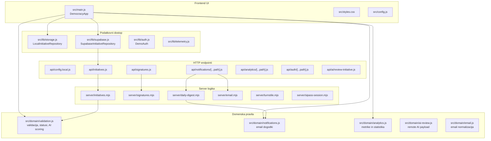

### Zakaj je arhitektura taka

- Frontend ostane preprost in pregleden, ker ni build koraka, ki bi skrival runtime nastavitve.
- Domenska pravila so v `src/domain`, da se ista validacija uporablja v UI, backendu in testih.
- Varnostno obcutljive operacije, kot so zapis pobude s service role kljucem, SI-PASS podpis, email posiljanje in Turnstile preverjanje, gredo prek backend endpointov.
- Supabase anon kljuc je javen in se uporablja samo za branje oziroma dovoljene javne RPC operacije; `SUPABASE_SERVICE_ROLE_KEY` ostane server-only.
- Lokalni development server posnema produkcijske endpoint-e, zato E2E smoke test preverja realno obliko aplikacije.

### Repozitorij in odgovornost datotek

| Pot | Namen |
| --- | --- |
| `src/main.js` | Glavna browser aplikacija, render pogledi, UI dogodki, izvoz PDF, povezava domene z repozitorijem. |
| `src/domain/validation.js` | Validacija pobude, statusi, lokalni AI scoring, glasovanje, podpisovanje, komentarji. |
| `src/domain/analytics.js` | Izracun metrik pobud, uporabnika in sistema. |
| `src/domain/notifications.js` | Gradnja email obvestil za statusne spremembe in dnevni digest. |
| `src/lib/supabase.js` | Supabase repozitorij, mapiranje SQL vrstic v domenski model, backend write endpointi. |
| `src/lib/storage.js` | Lokalni repozitorij za prototip in fallback. |
| `api/*` | Vercel entrypointi. Tanke HTTP plasti, ki delegirajo v `server/*`. |
| `server/*` | Server-only logika: service role Supabase requesti, SMTP, SI-PASS session, Turnstile, cron digest. |
| `supabase/schema.sql` | Osnovna shema, RLS, view-i in indeksi. |
| `supabase/search.sql` | Hybrid search RPC funkcije za full-text + fuzzy iskanje. |
| `tests/*` | Domain, E2E smoke in performance budget testi. |
| `.github/workflows/pipeline_demos.yml` | CI, testi, coverage in SonarCloud scan. |

### Podatkovni model in ER diagram

Fizicne tabele baze, ki jih projekt uporablja v osnovni shemi in dodatnih Supabase skriptah (`supabase/schema.sql`, `supabase/analytics.sql`, `supabase/sices-signatures.sql`):

- `initiatives` - pobude z avtorjem, statusom, vsebino in AI povzetkom.
- `votes` - glasovi uporabnikov oziroma anonimnih sej za posamezno pobudo.
- `signatures` - SI-PASS/SI-CeS evidenca podpisov, vkljucno s statusom podpisa in potjo podpisanega dokumenta.
- `comments` - komentarji na pobude.
- `initiative_ai_reviews` - zgodovina AI presoj in surovi odgovori modela.
- `system_analytics_events` - tehnicni in admin dogodki, ki jih zapisuje backend.
- `analytics_events` - centralni tok analiticnih dogodkov z opcijsko povezavo na pobudo.
- `analytics_clarity_snapshots` - uvozeni Microsoft Clarity snapshot-i.
- `analytics_daily_snapshots` - dnevni agregati pobud, glasov, podpisov, komentarjev in dogodkov.

`USER_IDENTITY` v diagramu ni fizicna tabela. Predstavlja stabilen identifikator uporabnika ali seje, ki se hrani kot `initiatives.author_ref`, `votes.voter_ref`, `signatures.signer_ref`, `comments.author_ref`, `system_analytics_events.user_ref` ali `analytics_events.user_ref`.

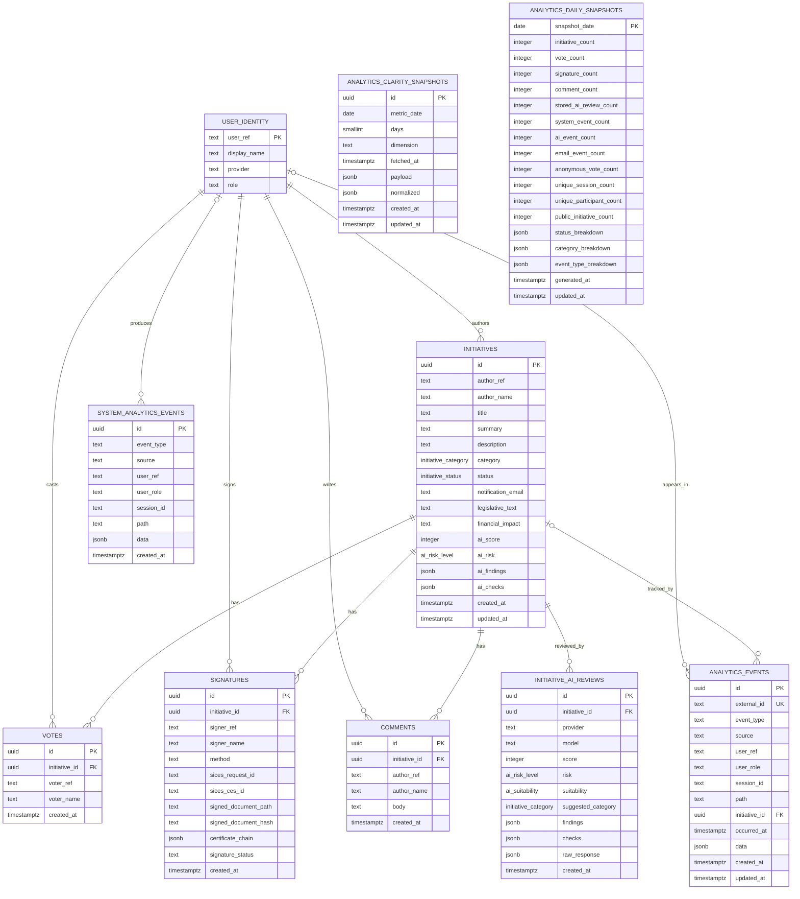

Ključni view-i:

- `initiative_detail`: pobuda skupaj z agregiranimi `votes`, `signatures` in `comments` JSON seznami.
- `initiative_analytics`: izracun stevila glasov, podpisov, komentarjev, support score in AI podatkov.
- `category_analytics`: agregacija po kategorijah.
- `analytics_*` view-i iz `supabase/analytics.sql`: dnevni dogodki, AI/email/frontend/business agregati ter povzetki pobud, kategorij in sistema.

### Stanja pobude

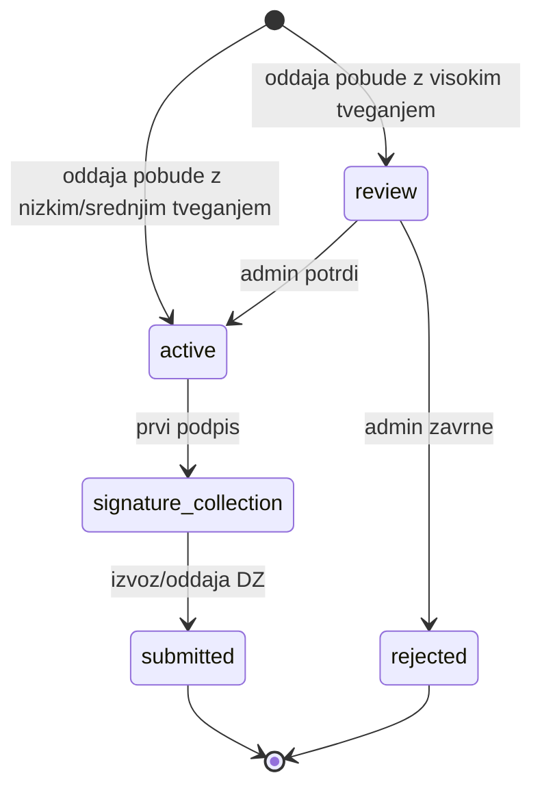

Pomen statusov:

| Status | Pomen |
| --- | --- |
| `draft` | Lokalni osnutek, ni namenjen bazi kot javna pobuda. |
| `review` | Pobuda potrebuje uredniski/admin pregled. |
| `active` | Pobuda je javno aktivna, mozno je glasovanje in komentiranje. |
| `signature_collection` | Pobuda zbira podpise, omogočen je izvoz za DZ. |
| `submitted` | Pobuda je pripravljena oziroma oddana DZ. |
| `rejected` | Pobuda je zavrnjena. |

### Tok oddaje pobude

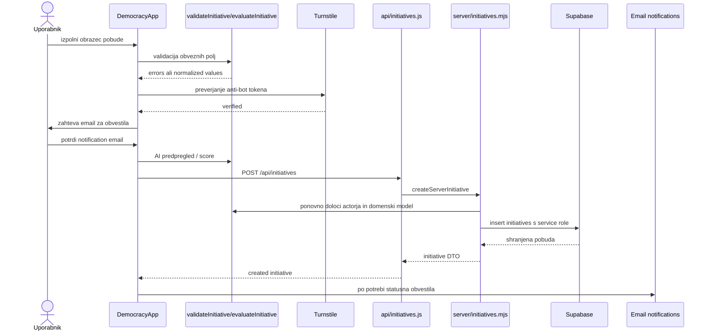

Zakaj se validacija ponovi na serverju: frontend validacija je za uporabnisko izkusnjo, server validacija pa je meja zaupanja. Actor, author, status in `notification_email` se na koncu zapisujejo prek backenda, da frontend ne more samovoljno zapisati tujih avtorjev ali obiti pravil.

### Tok glasovanja, komentarjev in podpisov

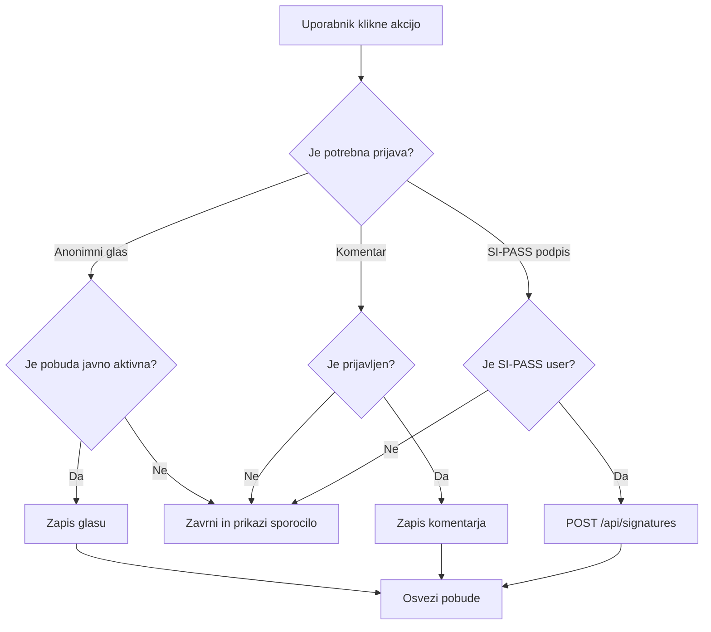

### Tok dnevnega email digest-a

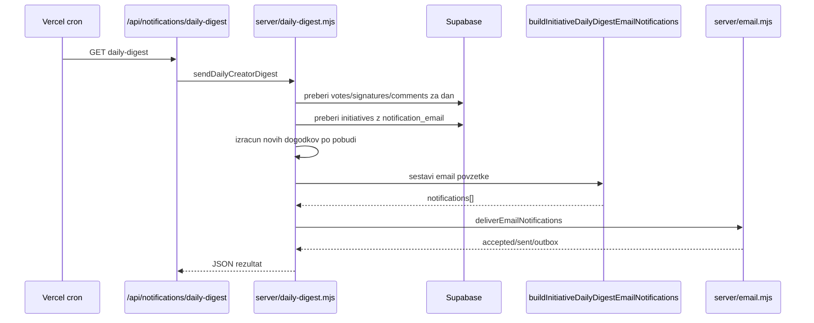

Pomembno: glasovi, komentarji in podpisi se ne posiljajo sproti, ampak se zdruzijo v en dnevni email po pobudi. Statusna sprememba pa se poslje takoj.

### AI predpregled

AI pregled ima dve plasti:

- Lokalni rule engine v `src/domain/validation.js`, ki vedno deluje in izracuna `score`, `risk`, `suitability`, `completeness`, `categorySuggestion` in `findings`.
- Remote AI endpoint `/api/ai/review-initiative`, ki uporablja Hugging Face, ce je nastavljen `HF_TOKEN`. Ce remote endpoint pade ali token ni nastavljen, frontend uporabi lokalni fallback.

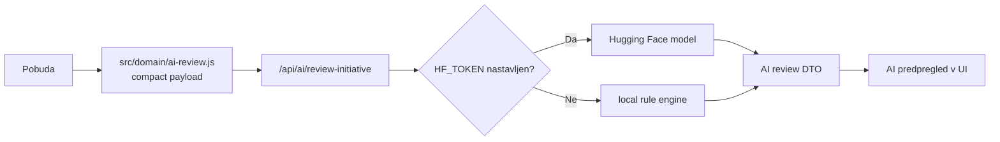

### Razredni oziroma modulni diagram

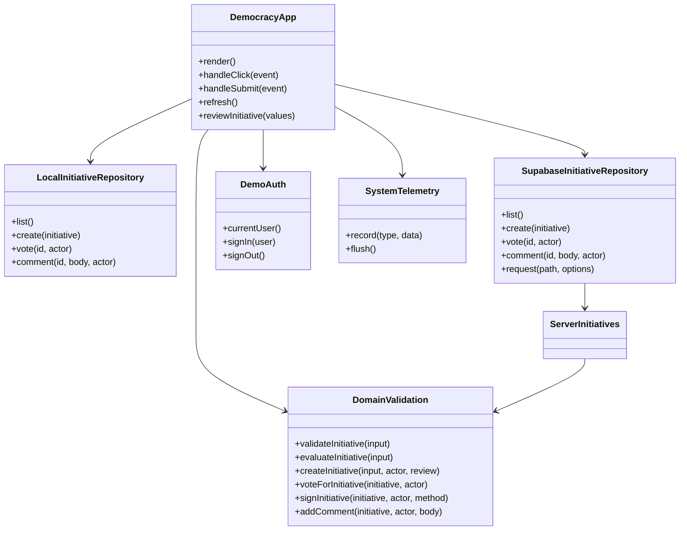

### Deployment diagram

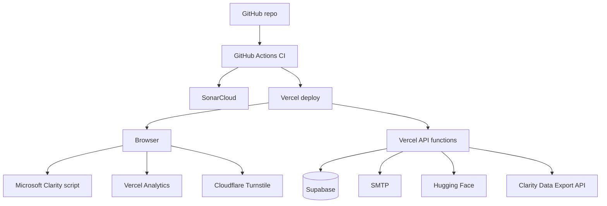

### Runtime konfiguracija in skrivnosti

Frontend dobi samo javne nastavitve prek `/config.local.js`. To pomeni, da so v browserju dovoljeni `SUPABASE_URL`, `SUPABASE_ANON_KEY`, public endpointi, Clarity project id in Turnstile site key. Vse skrivnosti ostanejo server-only:

- `SUPABASE_SERVICE_ROLE_KEY`
- `HF_TOKEN`
- `SMTP_PASS`
- `CLARITY_API_TOKEN`
- `TURNSTILE_SECRET_KEY`
- `SIPASS_SESSION_SECRET`
- `SIPASS_USER_REF_SALT`
- `CRON_SECRET`

CI ima dodatno preverjanje, da frontend ne bere server-only secretov.

### Kakovost, testi in SonarCloud

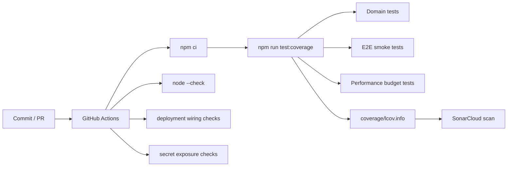

Kakovostne plasti:

| Plast | Kaj preverja |
| --- | --- |
| `tests/domain.test.mjs` | Validacija, AI scoring, analitika, email obvestila, SI-PASS session, backend servisne funkcije. |
| `tests/e2e.test.mjs` | Lokalni dev server, statični asseti, runtime config, osnovni API endpointi, 404. |
| `tests/performance.test.mjs` | Velikost zacetnega payload-a in lazy-loading DOCX/ODT generatorja. |
| `scripts/run-coverage.mjs` | Ustvari `coverage/lcov.info` za SonarCloud brez dodatnih dependencyjev. |
| SonarCloud | Reliability, maintainability, security hotspots, coverage in duplication. |
| GitHub Actions | Avtomatski pipeline za teste, syntax check, wiring check in secret check. |

### Projektno vodenje in nacin dela

Projekt je voden iterativno. Vsaka vecja funkcionalnost ima:

1. domensko pravilo ali helper v `src/domain`,
2. UI integracijo v `src/main.js`,
3. backend pot v `api/*` oziroma `server/*`, ce zahteva skrivnosti ali service role,
4. SQL spremembo v `supabase/*`, ce gre za trajne podatke,
5. test v `tests/domain.test.mjs`, `tests/e2e.test.mjs` ali `tests/performance.test.mjs`,
6. dokumentacijsko sled v README ali `docs/*`.

Pri spremembah velja pravilo: najprej se doloci podatkovni tok in meja zaupanja, potem se implementira UI. Varnostno obcutljive operacije ne ostanejo samo v browserju.

### Kako naj nov razvijalec zacne

1. Preberi ta README do konca, posebej diagrame arhitekture, ER in data flow.
2. Zazeni `npm test`, da dobis baseline.
3. Zazeni `npm run dev` in odpri lokalni URL.
4. Preglej `src/main.js` za UI tokove in `src/domain/validation.js` za poslovna pravila.
5. Preglej `server/initiatives.mjs`, `server/signatures.mjs`, `server/daily-digest.mjs` za backend meje zaupanja.
6. Preglej `supabase/schema.sql` in `supabase/search.sql`, ce delas na podatkih ali iskanju.
7. Pred spremembo naredi majhen test ali vsaj opredeli, kateri obstojeci test dokazuje, da vedenje ostaja pravilno.

## Zagon

```bash
npm run dev
```

Privzeti naslov je `http://localhost:5173`. Ce je port zaseden, razvojni streznik uporabi naslednji prosti port.

Za Render/Railway-style runtime zagon je na voljo tudi:

```bash
npm start
```

## Deployment env

Projekt uporablja runtime config skripto `/config.local.js`, ki v brskalnik poslje samo javne nastavitve. Lokalno jo generira `scripts/dev-server.mjs`, na Vercelu pa jo generira `api/config.local.js` prek pravila v `vercel.json`.

Za Vercel, Render ali Railway nastavite vsaj:

```bash
DATA_SOURCE=supabase
SUPABASE_URL=https://PROJECT_REF.supabase.co
SUPABASE_ANON_KEY=PUBLIC_ANON_KEY
AI_PROVIDER=huggingface
MICROSOFT_CLARITY_PROJECT_ID=...
SYSTEM_ANALYTICS_ENDPOINT=/api/analytics/system
CLARITY_ANALYTICS_ENDPOINT=/api/analytics/clarity
TURNSTILE_SITE_KEY=...
TURNSTILE_ENDPOINT=/api/security/turnstile
```

Koda podpira tudi `VITE_*` alias kljuce, ce deployment uporablja pravi Vite build:

```bash
VITE_DATA_SOURCE=supabase
VITE_SUPABASE_URL=https://PROJECT_REF.supabase.co
VITE_SUPABASE_ANON_KEY=PUBLIC_ANON_KEY
VITE_AI_PROVIDER=huggingface
```

Po spremembi env varov na hostingu je potreben nov deploy oziroma redeploy. `SUPABASE_SERVICE_ROLE_KEY`, `HF_TOKEN`, `CLARITY_API_TOKEN`, SMTP gesla in podobni privatni kljuci ne smejo biti `VITE_*` in ne smejo v frontend.

Za zascito oddaje pobud pred avtomatiziranimi oddajami nastavite Cloudflare Turnstile. Public `TURNSTILE_SITE_KEY` gre v runtime config, server-only `TURNSTILE_SECRET_KEY` pa ostane samo v Vercel oziroma strezniskem okolju. Dodatno lahko omejite dovoljene hoste z `TURNSTILE_ALLOWED_HOSTNAMES`.

Obstojeci backend endpointi imajo aplikacijski in-memory rate limiting in vracajo `429`, ko isti odjemalec preseze dovoljeno stevilo zahtevkov. V produkciji to dopolnite se s Cloudflare Rate Limiting pravili, ker serverless instance nimajo globalnega trajnega stevca.

Ce zelite, da admin sistemska analitika na Vercelu bere skupne dogodke vseh uporabnikov, dodajte tudi server-only `SUPABASE_SERVICE_ROLE_KEY` in v Supabase izvedite zadnjo verzijo `supabase/schema.sql`, ki vsebuje tabelo `system_analytics_events`.

SI-PASS podpis pobude uporablja backend endpoint `/api/signatures`, zato za produkcijski podpis dodajte server-only `SUPABASE_SERVICE_ROLE_KEY` in v Supabase izvedite `supabase/signatures-security.sql`, ki zapre direktno vstavljanje podpisov prek javnega anon kljuca.

Ce uporabljate SI-CeS oziroma zelite zadnjo verzijo podpisnih polj, po osnovni shemi izvedite tudi `supabase/sices-signatures.sql`. SI-CeS logika je v `server/sices.mjs`, produkcijski klici pa so zaradi mTLS digitalnega potrdila speljani prek VPS bridgea na `auth.demokracija-20.si`.

Za razsirjeno shranjevanje vseh analiticnih dogodkov, dnevne snapshot-e in SQL porocila po `supabase/schema.sql` izvedite se `supabase/analytics.sql`.

Za Supabase RPC hybrid search funkciji, ki podpirata iskanje pobud prek full-text + fuzzy ujemanja, po `supabase/schema.sql` izvedite se `supabase/search.sql`. Ta dva SQL skripta morata biti posodobljena tudi zaradi stolpca `notification_email`, ki ga uporablja dnevni email povzetek ustvarjalcu pobude. Ko je `DATA_SOURCE=supabase` in uporabnik vnese iskalni niz, aplikacija uporabi RPC `search_initiatives`; brez iskalnega niza ostane lokalno filtriranje ze nalozenih pobud.

Ce zelite, da uporabniki v aplikaciji vidijo agregirane Clarity grafe v zavihku `Analitika pobud`, v Vercel dodajte se server-only `CLARITY_API_TOKEN`. Ta token pridobi admin projekta v Microsoft Clarity pod Settings -> Data Export.

## Testi

```bash
npm test
```

Celoten ukaz zaporedno izvede domenske teste, E2E smoke test lokalnega streznika in performance budget test. Posamezne plasti lahko poganjate tudi loceno:

```bash
npm run test:domain
npm run test:e2e
npm run test:performance
npm run test:coverage
```

E2E test zazene `scripts/dev-server.mjs`, preveri aplikacijsko lupino, runtime config, glavne statice, AI fallback endpoint, email endpoint brez obvestil, Turnstile fallback in 404 odziv. Performance test preverja velikost zacetnega HTML/JS/CSS payload-a, locene budgete za `main.js` in `styles.css` ter to, da se DOCX/ODT generator nalozi sele ob prenosu dokumenta.
Coverage ukaz ustvari `coverage/lcov.info`, ki ga GitHub workflow poslje v SonarCloud.

## Trenutno pokrito

- razvojna prijava za lokalno preverjanje SI-PASS in admin scenarijev,
- oddaja pobude z osnovno validacijo,
- Hugging Face AI predpregled besedila pobude s score, risk, suitability, completeness in categorySuggestion,
- lokalni AI predpregled kot fallback, kadar Hugging Face ni nastavljen ali ni dosegljiv,
- pregled, iskanje, filtriranje in razvrscanje pobud,
- javni pregled aktualnih pobud za neprijavljene uporabnike,
- anonimno glasovanje z omejitvijo enega glasu na pobudo na lokalni brskalniski ID,
- glasovanje, SI-PASS evidencni podpis, komentarji in statusi,
- PDF tiskanje, PDF prenos, DOCX/Word in ODT prenos pobude za DZ pri statusih `signature_collection` in `submitted`, tudi za SI-PASS prijavljenega uporabnika,
- email obvestila ustvarjalcu pobude ob spremembi statusa in dnevni povzetek novih glasov, podpisov ter komentarjev,
- napredna statistika glasov na pobudo, kategorije, komentarje in AI tveganja,
- osebna analitika pobud za prijavljenega uporabnika,
- admin sistemska analitika za oceno AI klicev, tokenov, email dogodkov in frontend virov,
- Vercel Web Analytics za hosting/SEO statistiko,
- Vercel Speed Insights za Core Web Vitals in performance metrike,
- Microsoft Clarity za vedenjsko analitiko sej, custom tags in events,
- Cloudflare Turnstile server-side preverjanje za oddajo pobude,
- aplikacijski rate limiting za obstojece backend endpoint-e,
- varnostni HTTP headerji in CSP za Vercel ter lokalni razvojni streznik,
- Supabase SQL shema in konfiguracijski nastavki,
- povzetek SI-PASS testnega okolja,
- SI-CeS strezniski tok za podpisni zahtevek, callback in razsirjena podpisna polja prek VPS bridgea,
- celostni E2E smoke test lokalnega streznika in osnovnih API tokov,
- performance budget test za zacetni payload in lazy-loading DOCX/ODT izvoza.

## Glavni uporabniki in pravice

Glavne vloge aplikacije so:

- **Neprijavljen uporabnik**: pregleda javno vidne aktualne pobude, isce in filtrira javni seznam ter odda en anonimen glas na pobudo.
- **SI-PASS prijavljen uporabnik**: uporablja vse javne funkcije, odda pobudo, glasuje, komentira, izvede SI-PASS evidencni podpis, vidi osebno analitiko ter izvozi PDF/DOCX/ODT dokument pri statusih `signature_collection` in `submitted`.
- **Admin**: uporablja administrativne funkcije za urejanje statusov, pregled integracij in sistemsko analitiko. Admin pravica je locena od SI-PASS podpisa; SI-PASS podpis se izvede samo s SI-PASS sejo.

Razvojna demo prijava ni locena glavna vloga. Uporablja se samo za lokalno preverjanje zgornjih scenarijev, kadar prava SI-PASS seja ali admin prijava nista na voljo.

## Dokumentacija

- `docs/pregled-projekta.md` - celovit tehnicni in funkcionalni pregled projekta,
- `docs/stanje-zadnje-verzije.md` - krovni povzetek zadnje verzije, vlog, funkcionalnosti, baze, API-jev in iteracij,
- `docs/funkcionalnosti.md` - zivi register funkcionalnosti, statusov, dokazov v kodi in preverjanja,
- `docs/analitika.md` - tri analiticne plasti in navodila za Vercel, Clarity in admin pogled,
- `docs/varnost.md` - Turnstile, WAF/CDN, ZAP in produkcijske varnostne omejitve,
- `docs/hybrid-search.md` - Supabase RPC hybrid search, SQL funkcije, frontend tok in troubleshooting,
- `docs/dnevnik-dopolnitev.md` - sprotni dnevnik dopolnitev in kronologija commitov,
- `docs/git-zgodovina.md` - kronoloski povzetek razvoja iz git zgodovine,
- `docs/roadmap.md` - izvedba po iteracijah,
- `docs/devwork-loop.md` - sprotna porocila in kontrolne tocke,
- `docs/iteracija-3-analitika-ai.md` - analitika, AI predpregled, shema in Hugging Face pot,
- `docs/diagrams.md` - Mermaid use-case, UML, ER in zaporedni diagrami,
- `docs/classDiagram.mmd` - izvor UML class diagrama,
- `docs/erDiagram.mmd` - izvor ER diagrama,
- `docs/sequenceDiagram.mmd` - izvor zaporednega diagrama,
- `docs/flowchart LR.mmd` - izvor Mermaid use-case diagrama glavnih uporabnikov,
- `docs/ci-cd-pipeline.md` - trenutni GitHub Actions pipeline,
- `docs/supabase.md` - Supabase povezava,
- `docs/baza-porocilo.md` - porocilo o zasnovi baze in razlogih za podatkovni model,
- `docs/si-pass-testno-okolje.md` - razvojne opombe za SI-PASS,
- `docs/sipass-podpisi.md` - SI-PASS evidencni podpis pobude prek backend endpointa,
- `docs/sipass-sicas-ces-priklop.md` - podrobnejsi opis SI-PASS, SI-CAS in SI-CeS priklopa,
- `docs/sicas-vps-vzpostavitev.md` - zapisnik izvedene VPS/Shibboleth vzpostavitve in VPS checklist,
- `docs/sicas-sp-metadata.xml` - staticni SI-CAS SP metadata izvoz brez Shibboleth opozorilnega komentarja.

## Hitri pregled po konceptih

1. Preberite `docs/pregled-projekta.md` za arhitekturo, DevWork koncept in znane omejitve.
2. Preverite `docs/funkcionalnosti.md` za seznam implementiranih, delnih in pripravljenih funkcionalnosti.
3. Preverite `docs/git-zgodovina.md` za dokaz iterativnega razvoja.
4. Zazenite `npm test`.
5. Zazenite `npm run dev` in rocno preverite oddajo pobude, glasovanje, podpis, komentar, AI predpregled in analitiko.

## Hugging Face

Kljuc naj bo samo v `.env.local` ali okolju, ne v `src` datotekah:

```bash
AI_PROVIDER=huggingface
AI_REVIEW_ENDPOINT=/api/ai/review-initiative
HUGGINGFACE_ZERO_SHOT_MODEL=facebook/bart-large-mnli
HUGGINGFACE_EMBEDDING_MODEL=intfloat/multilingual-e5-small
HF_TOKEN=hf_...
```

Lokalno endpoint `/api/ai/review-initiative` zagotovi `scripts/dev-server.mjs`, na Vercelu pa `api/ai/review-initiative.js`. Frontend vidi samo endpoint, `HF_TOKEN` ostane server-only. Ob napaki aplikacija samodejno pade nazaj na lokalno presojo.

## SI-PASS prijava

Gumb `SI-PASS prijava` odpira VPS bridge na `auth.demokracija-20.si`. Bridge mora biti za pot `/auth/sipass/complete` zasciten s Shibbolethom, nato pa Vercel aplikaciji izda sifrirano sejo prek `HttpOnly` cookieja za domeno `.demokracija-20.si`.

Potrebni skrivni nastavitvi na VPS in Vercelu sta isti:

```env
SIPASS_SESSION_SECRET=...
SIPASS_USER_REF_SALT=...
```

Apache proxy, `attribute-map.xml` in ostale VPS spremenljivke so opisane v `docs/sipass-sicas-ces-priklop.md`.

### SI-CAS testno okolje in VPS bridge

SI-PASS prijava v projektu tehnicno tece prek SI-CAS testnega okolja in Shibboleth Service Providerja na VPS strezniku. Glavna aplikacija je objavljena na `https://demokracija-20.si`, prijavni bridge pa na `https://auth.demokracija-20.si`.

Izveden tok:

1. Uporabnik v aplikaciji klikne `SI-PASS prijava`.
2. Frontend odpre `https://auth.demokracija-20.si/auth/sipass/login`.
3. VPS bridge preusmeri uporabnika na Shibboleth login handler z `entityID=SICAS`.
4. SI-CAS testno okolje izvede prijavo uporabnika.
5. Uporabnik se vrne na zasciteno pot `/auth/sipass/complete`.
6. Apache/Shibboleth preda dogovorjene atribute Node bridgeu.
7. Bridge ustvari sifriran `HttpOnly` cookie za domeno `.demokracija-20.si`.
8. Vercel frontend uporablja sejo za oddajo pobud, komentarje, osebno analitiko in podpise.

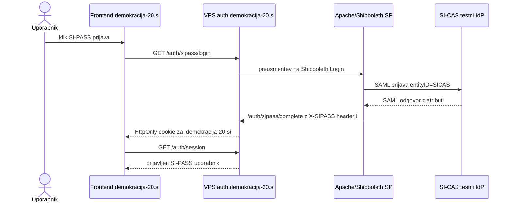

Na VPS tece Node aplikacija iz tega repozitorija kot systemd servis `demos-auth`. Servis poslusa na `127.0.0.1:5173`, Apache pa nanj proxyja SI-PASS in SI-CeS poti. Preverjanje servisa:

```bash
sudo systemctl status demos-auth
sudo journalctl -u demos-auth -f
curl -i https://auth.demokracija-20.si/auth/sipass/login
```

Pricakovani rezultat za login endpoint je HTTP preusmeritev na Shibboleth/SI-CAS prijavo. Za SI-CeS endpoint `GET /api/sices/start` je pricakovan `405 Method Not Allowed`, ker pravi zacetek podpisa uporablja `POST`.

### SI-CeS elektronski podpis

SI-PASS podpis v aplikaciji je evidencni podpis: backend shrani vrstico v `signatures` z `method = 'sipass'`. SI-CeS je locen tok za elektronski podpis dokumenta oziroma podpisnega zahtevka prek drzavne storitve CES-Sign/SicesSign.

SI-CeS se ne izvaja v brskalniku in se ne izvaja na Vercel serverless funkciji. Razlog je, da SI-CeS SOAP servis zahteva klient digitalno potrdilo za mTLS. Zato je SI-CeS del na VPS, kjer sta varno shranjena PFX potrdilo in geslo.

Tok SI-CeS podpisa:

1. SI-PASS prijavljen uporabnik klikne podpis pobude.
2. Frontend poklice `POST https://auth.demokracija-20.si/api/sices/start`.
3. VPS backend preveri SI-PASS sejo iz `HttpOnly` cookieja.
4. Backend iz Supabase prebere pobudo in sestavi XML dokument za podpis.
5. Backend izvede SOAP `putRequest` na SI-CeS testni servis z mTLS PFX potrdilom.
6. SI-CeS vrne `requestId` in URL za podpis.
7. Frontend uporabnika preusmeri na SI-CeS podpisno stran.
8. Po koncanem podpisu SI-CeS vrne uporabnika na `SICES_CALLBACK_URL`.
9. Backend prek `getSignedData` prevzame rezultat podpisa in posodobi vrstico v `signatures`.

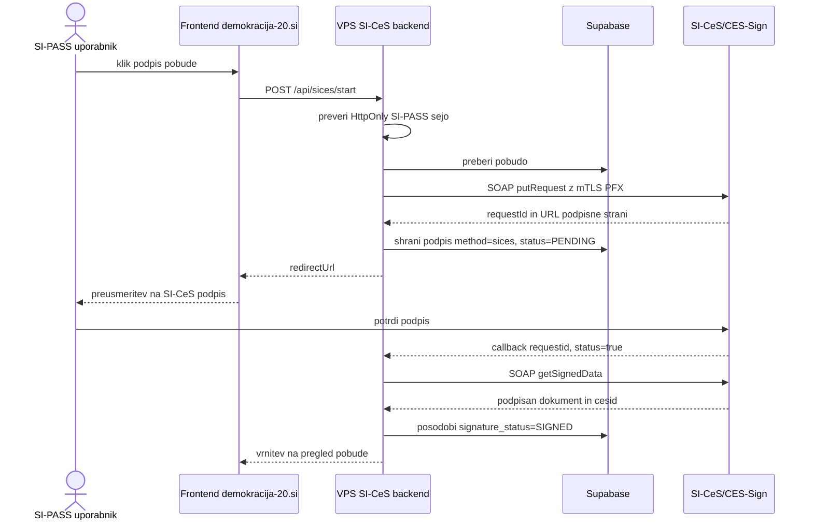

Uporabljeni backend endpointi na VPS:

```text
POST /api/sices/start
GET  /api/sices/callback
GET  /api/sices/complete
POST /api/sices/complete
```

Frontend v produkciji klice VPS endpointa prek runtime configa:

```env
SICES_ENABLED=true
SICES_START_ENDPOINT=https://auth.demokracija-20.si/api/sices/start
SICES_COMPLETE_ENDPOINT=https://auth.demokracija-20.si/api/sices/complete
```

### Pridobitev in uporaba SI-CeS digitalnega potrdila

Za dostop do SI-CeS testnega okolja je bilo treba ponudniku SI-CeS sporociti, s katerim klient digitalnim potrdilom bo aplikacija klicala SOAP servis. SI-CeS ekipa je zahtevala tocno razlocevalno ime potrdila oziroma predlagala, da servis poklicemo s potrdilom, da lahko sami vpisijo pravilen niz.

Dogovorjeni `serviceProvider` za projekt:

```text
UNI-MB_eDemokracija
```

SI-CeS ekipi smo poslali javni del potrdila (`.cer`) za testno okolje. SI-CeS ekipa je potrdilo odobrila in nam sporocila, da nadaljujemo z urejanjem klica po uradnih navodilih za SICESSign. Za dejanski mTLS klic pa `.cer` ni dovolj, ker vsebuje samo javni del potrdila. Na VPS mora biti namescen `.pfx` oziroma `.p12`, ki vsebuje tudi zasebni kljuc.

Potrdilo na VPS:

```bash
/opt/demos/secrets/sices-client.pfx
```

`.cer` se lahko uvozi v brskalnik ali Windows cert store samo za ogled oziroma preverjanje potrdila. Za SI-CeS klic ga aplikacija ne uporablja. Za klic je potreben PFX z zasebnim kljucem, ki ostane na VPS in ne gre v repozitorij ali frontend.

### SI-CeS nastavitve na VPS

SI-CeS nastavitve so v `/opt/demos/.env.local`. Secret vrednosti se ne commita v repozitorij.

```env
SICES_ENABLED=true
SICES_SERVICE_PROVIDER=UNI-MB_eDemokracija
SICES_ENDPOINT=https://sicas-test.sigov.si/CES-Sign/SicesSign
SICES_CALLBACK_URL=https://auth.demokracija-20.si/api/sices/callback
SICES_PFX_PATH=/opt/demos/secrets/sices-client.pfx
SICES_PFX_PASSWORD=...
SICES_TRUST_LEVEL=Medium
SICES_MIME_TYPE=XML
SICES_SIGNATURE_LEVEL=XAdES_BASELINE_B
SICES_SIGNATURE_PACKAGING=ENVELOPED
SICES_SIGNER_CITY=Ljubljana
SICES_SIGNER_COUNTRY=Slovenija
SICES_SIGNER_LOCALITY=Rudnik
SICES_SIGNER_POSTAL_ADDRESS=Ukmarjeva 2
SICES_SIGNER_POSTAL_CODE=1000
SICES_SIGNER_STATE_OR_PROVINCE=Ljubljana
SICES_TLS_VERSION=TLSv1.2
SICES_SOAP_TIMEOUT_MS=30000
SICES_ALLOWED_ORIGIN=https://demokracija-20.si
```

Backend podpira tudi `SICES_PFX_BASE64`, vendar je na VPS bolj pregledna uporaba `SICES_PFX_PATH`, ker se tako izognemo zelo dolgi base64 vrednosti v `.env.local`.

Za Supabase pisanje mora imeti isti VPS tudi server-only service role kljuc:

```env
SUPABASE_URL=https://PROJECT_REF.supabase.co
SUPABASE_SERVICE_ROLE_KEY=...
```

### SI-CeS SOAP zahtevek

Backend pri zacetku podpisa poslje SOAP `putRequest`. Poenostavljen primer zahtevka:

```xml
<?xml version="1.0" encoding="UTF-8"?>
<soapenv:Envelope xmlns:soapenv="http://schemas.xmlsoap.org/soap/envelope/" xmlns:ws="http://ws.sign.sices.osi.si/">
  <soapenv:Header/>
  <soapenv:Body>
    <ws:putRequest>
      <serviceProvider>UNI-MB_eDemokracija</serviceProvider>
      <callback>https://auth.demokracija-20.si/api/sices/callback?initiativeId=...</callback>
      <item>
        <document>
          <bytes>base64-xml-dokumenta-pobude</bytes>
          <mimeType>
            <mimeTypeString>XML</mimeTypeString>
          </mimeType>
          <name>pobuda-...xml</name>
        </document>
        <parameters>
          <digestAlgorithm>SHA256</digestAlgorithm>
          <encryptionAlgorithm>RSA</encryptionAlgorithm>
          <signatureLevel>XAdES_BASELINE_B</signatureLevel>
          <signaturePackaging>ENVELOPED</signaturePackaging>
          <signerLocation>
            <city>Ljubljana</city>
            <country>Slovenija</country>
            <locality>Rudnik</locality>
            <postalAddress>Ukmarjeva 2</postalAddress>
            <postalCode>1000</postalCode>
            <stateOrProvince>Ljubljana</stateOrProvince>
          </signerLocation>
        </parameters>
      </item>
      <trustLevel>Medium</trustLevel>
    </ws:putRequest>
  </soapenv:Body>
</soapenv:Envelope>
```

HTTP klic uporablja:

```text
POST https://sicas-test.sigov.si/CES-Sign/SicesSign
Content-Type: text/xml; charset=utf-8
SOAPAction: http://ws.sign.sices.osi.si/SicesSign/putRequestRequest
TLS: TLSv1.2
Client certificate: /opt/demos/secrets/sices-client.pfx
```

### Potek SI-CeS podpisa

Pri SI-CeS okolju uporabnik po kliku na podpis se zacne zunanji podpisni tok:

1. Aplikacija na VPS poslje `POST /api/sices/start`.
2. VPS s klientskim PFX potrdilom poklice SI-CeS SOAP metodo `putRequest`.
3. SI-CeS vrne `requestId` in URL podpisne strani.
4. Frontend uporabnika preusmeri na vrnjeni SI-CeS URL.
5. Uporabnik v SI-CeS vmesniku pregleda in potrdi podpis.
6. SI-CeS uporabnika preusmeri nazaj na `SICES_CALLBACK_URL` z `requestid` in `status=true`.
7. VPS backend z `getSignedData` prevzame podpisan dokument oziroma podpisni paket.
8. V Supabase se posodobi vrstica v `signatures`:

```text
method = sices
sices_request_id = requestId iz SI-CeS
sices_ces_id = CES identifikator podpisnika, ce ga SI-CeS vrne
signature_status = SIGNED
signed_document_hash = SHA-256 hash podpisanega dokumenta
certificate_chain = veriga potrdil, ce jo SI-CeS vrne
```

9. Pobuda ostane v statusu zbiranja podpisov oziroma se po prvem podpisu prestavi v `signature_collection`.
10. Uporabnik se vrne v aplikacijo na pregled pobude, kjer se prikaze posodobljeno stevilo podpisov.

Administrativno preverjanje VPS okolja:

```bash
sudo -u demos test -r /opt/demos/secrets/sices-client.pfx && echo "PFX OK"
curl -i https://auth.demokracija-20.si/api/sices/start
sudo journalctl -u demos-auth -f
```

`curl` na `GET /api/sices/start` mora vrniti `405 Method Not Allowed`, ker endpoint obstaja, vendar sprejema `POST`.

## Analitike

Projekt uporablja tri locene analiticne plasti:

- **Vercel Web Analytics**: promet, strani in SEO pogled v Vercel dashboardu; vidi ga lastnik hostinga.
- **Vercel Speed Insights**: Core Web Vitals in hitrost strani v Vercel dashboardu; vidi ga lastnik hostinga.
- **Sistemska analitika**: pogled samo za admin email, nastavljen v `ADMIN_EMAILS`; namenjen je oceni obremenitev, AI klicev, tokenov, email dogodkov, uporabniskih sledi in javne vidnosti pobud.
- **Analitika pobud**: aplikacijski pogled za splosne metrike pobud, osebno statistiko prijavljenega uporabnika in agregirane Clarity grafe prek server-side Data Export API. Microsoft Clarity dodatno belezi seje, custom tags in dogodke.

Brez prijave je vidna samo zacetna stran z aktualnimi pobudami. Neprijavljen uporabnik lahko odda en anonimen glas na pobudo, ne vidi pa oddaje pobude, podpisovanja, komentarjev, osebne analitike, integracij ali sistemske analitike.

Za interni pogled v `.env` ali Vercel nastavite `ADMIN_EMAILS`, nato se z istim emailom prijavite prek gumba `Demo prijava`.

Za Clarity nastavite:

```bash
MICROSOFT_CLARITY_PROJECT_ID=...
CLARITY_API_TOKEN=...
```

Podrobna navodila so v `docs/analitika.md`.

## Email obvestila

Statusna sprememba pobude takoj pošlje email ustvarjalcu pobude. Glasovi, SI-PASS podpisi in komentarji se ne pošiljajo sproti; Vercel cron enkrat dnevno pokliče `GET /api/notifications/daily-digest` in ustvarjalcu pošlje en dnevni povzetek po pobudi, npr. `Število novih glasov: +2134`.

Lokalno endpoint zagotovi `scripts/dev-server.mjs`, na Vercelu pa `api/notifications/[...path].js`. Brez SMTP nastavitev se obvestila samo zabelezijo v log; za dejansko posiljanje nastavite SMTP podatke v `.env.local` ali v deployment env:

```bash
EMAIL_NOTIFICATIONS_ENDPOINT=/api/notifications/email
PUBLIC_SITE_URL=https://demokracija-20.si
DAILY_DIGEST_TIME_ZONE=Europe/Ljubljana
CRON_SECRET= ....
SMTP_HOST=smtp.gmail.com
SMTP_PORT=587
SMTP_STARTTLS=true
SMTP_USER=...
SMTP_PASS=...
SMTP_FROM="Demokracija 2.0 <no-reply@example.com>"
```

Za testiranje vseh obvestil na en naslov in tudi dogodkov, ki jih sprozi isti uporabnik, lahko dodate:

```bash
EMAIL_TEST_RECIPIENT=test@example.com
EMAIL_NOTIFY_ACTOR=true
```
