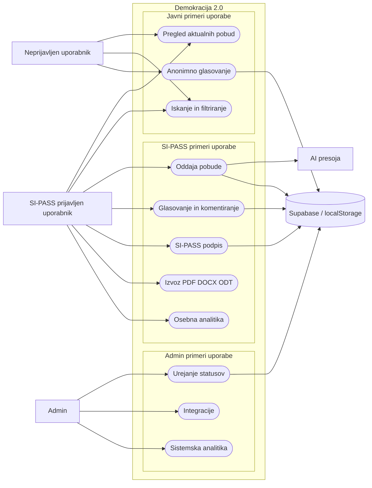
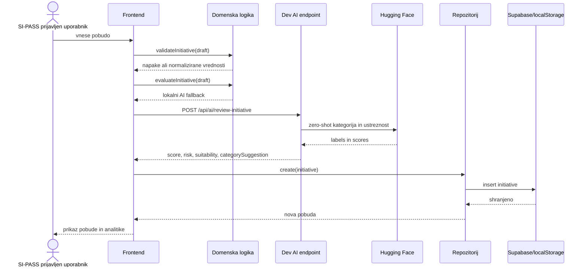
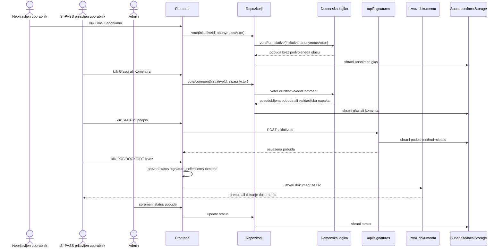
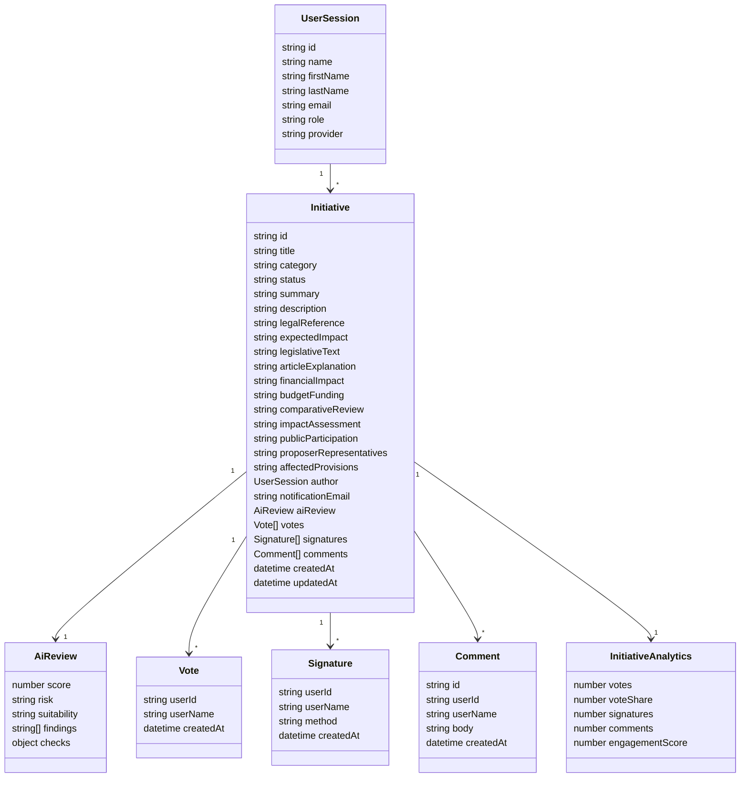
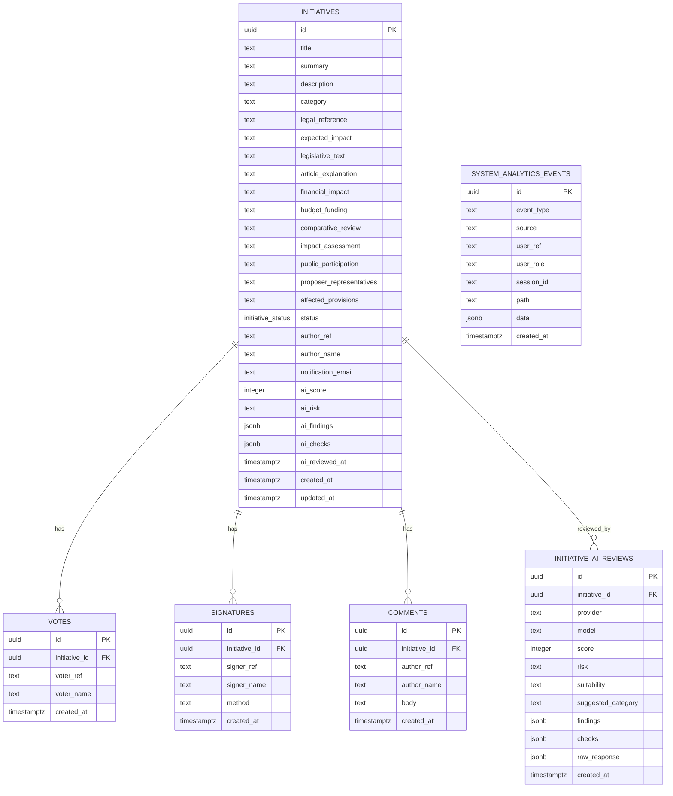
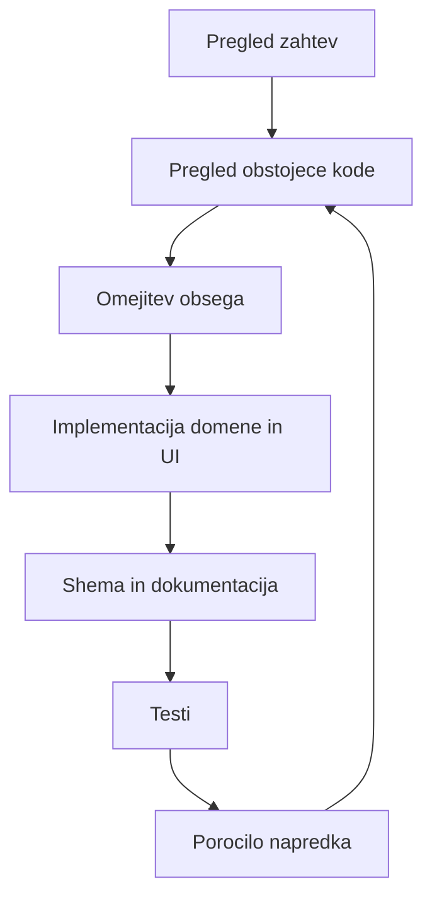

# Mermaid diagrami

Diagrami pokrivajo obseg pobud, glasovanja, komentarjev, SI-PASS podpisov, izvoza dokumentov, analitike in AI presoje. Glavni uporabniki so neprijavljen uporabnik, SI-PASS prijavljen uporabnik in admin.

## Uporabniski diagram

## Tok oddaje pobude

## Glasovanje, podpis in izvoz

## UML domenskih objektov

## ER shema

## DevWork loop

