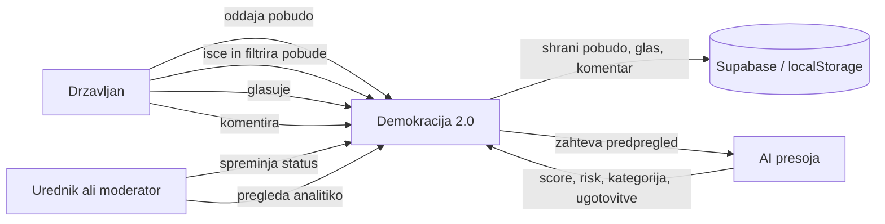
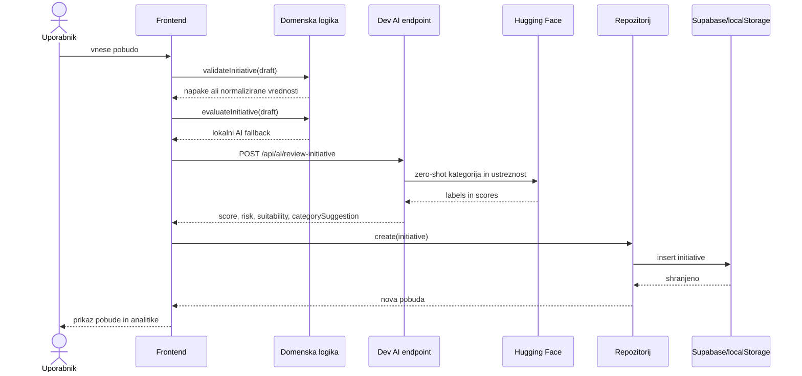
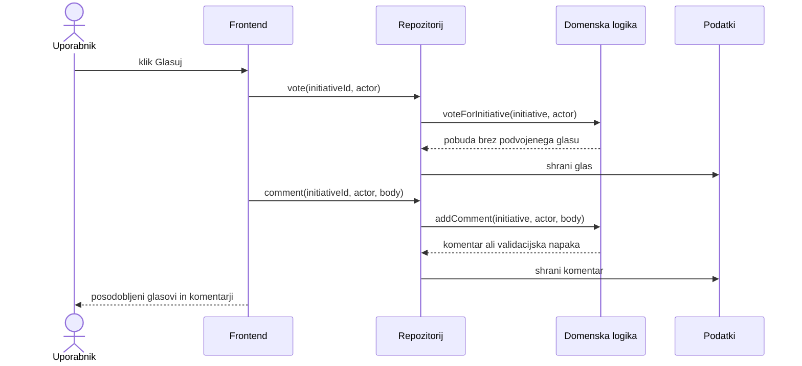
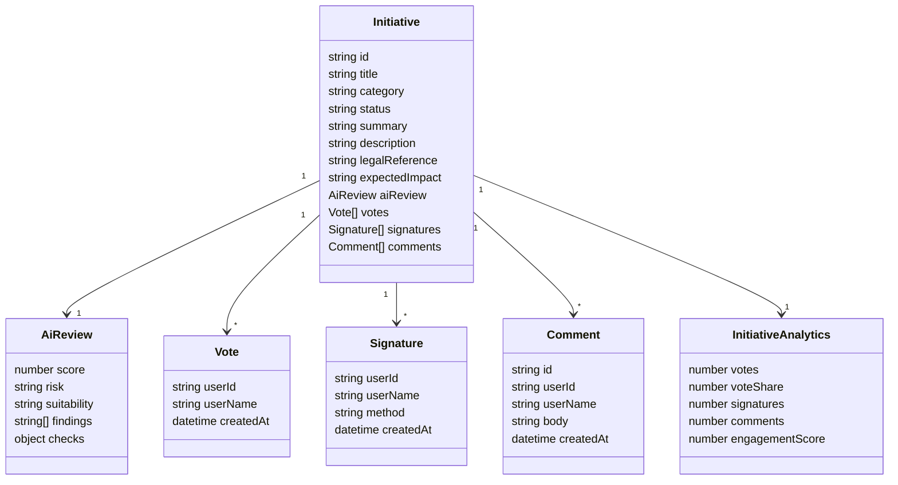
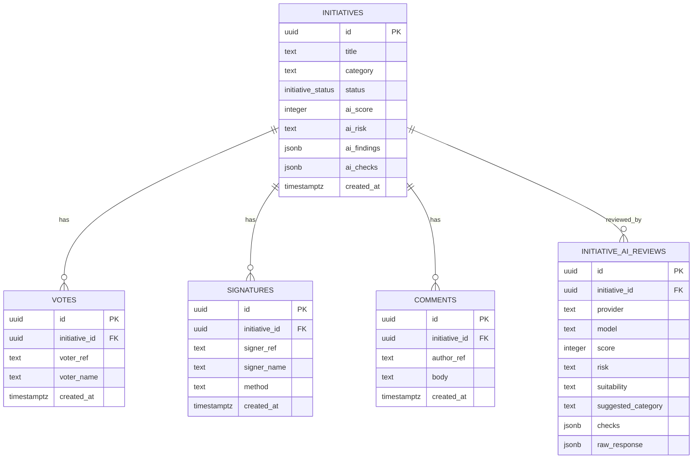
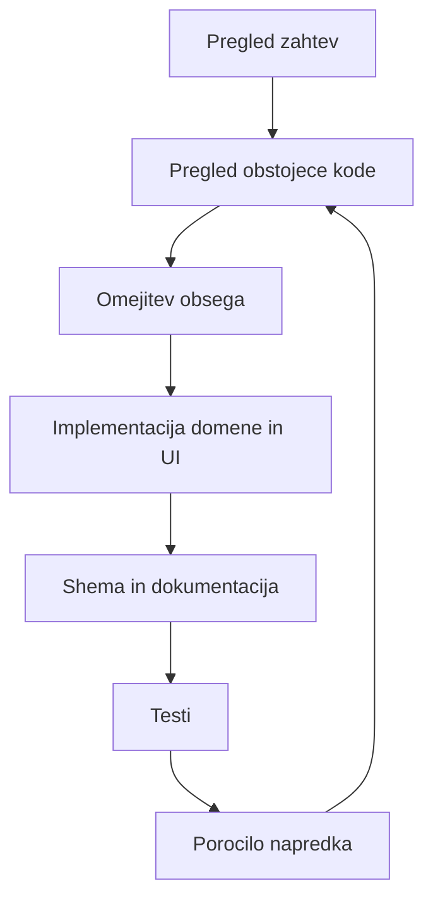

# Mermaid diagrami

Diagrami pokrivajo samo obseg pobud, glasovanja, komentarjev, analitike in AI presoje.

## Uporabniski diagram

## Tok oddaje pobude

## Glasovanje in komentiranje

## UML domenskih objektov

## ER shema

## DevWork loop

